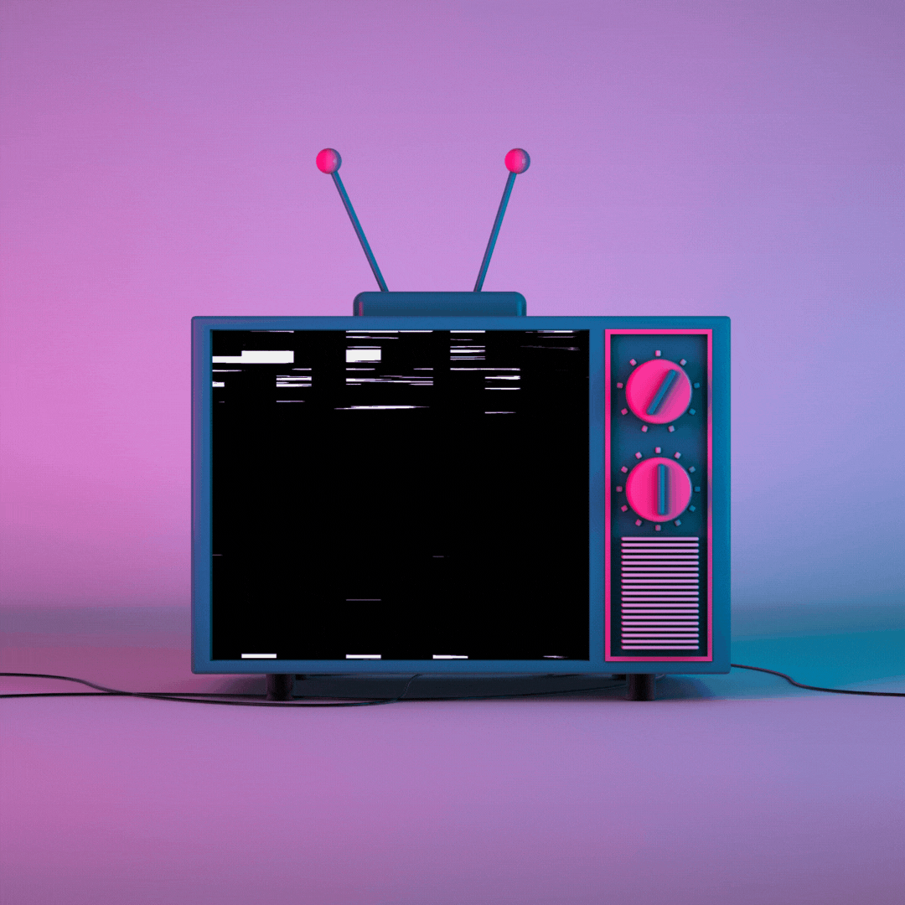

	 
		
	 
 	 
	       
         

	-  🔹Hi, I’m @John Paul🔹
	-  🔹I’m interested in Designing,Developing🔹
	- 🔹 I’m currently learning Computer Engineering🔹
	- 🔹 I’m looking to collaborate on Web Apps🔹
	
	## My Skillset Includes:
	-  🔸JavaScript,HTML,Python,Bit of Bash🔸
	-  🔸TailwindCSS, CSS🔸
	-  🔸MySQL, SQL, MongoDB🔸
	-  🔸UI/UX Designing🔸
	
	## My Tools of Trade:
	- 🔺 Figma,Canva🔺
	- 🔺 Linux(Kali)🔺
	- 🔺 Git 🔺
	- 🔺 Appwrite (for backend)🔺
	
	## Contact Me !
	🔺 [My Linkedin](https://www.linkedin.com/in/john-paul-572496278/)
	🔺 [My Twitter](https://twitter.com/iamjohnpaulr5) 
